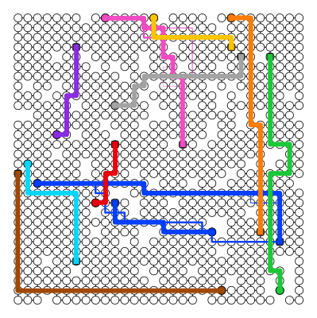
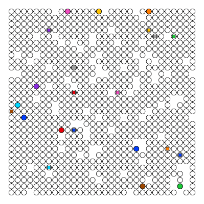

mappcf
---
[](LICENCE.txt)
[](https://github.com/Kei18/mappfd/actions/workflows/ci.yaml)

The code repository of the paper "Fault-Tolerant Offline Multi-Agent Path Planning" (MAPPCF).
The entire code is written in Julia 1.7.

## Demo




- (first) Solution example. Each agent has a backup path as necessary.
- (second) Execution demo. A red agent is crashed in the middle (turning to a diagonal shape, gray-filled). The left-blue agent changes its executing path.

## Setup

```sh
julia --project=. -e 'using Pkg; Pkg.instantiate()'
```

It may require around 5min.

## Minimum Example

A toy example is available on Jupyter Lab.

```sh
julia --project=. -e "using IJulia; jupyterlab()"
```

See `notebooks/toy-example.ipynb`.

## Reproduction

### Benchmark Generation

```sh
julia --project=. --threads=auto
> include("scripts/benchmark_gen.jl")
> create_benchmarks()
```

The used instances are included in `assets/benchmark.zip`.
Please unzip them to `../data/benchmark/`.

### Experiments

<details><summary>random-32-32-10</summary>

```sh
julia --project=. --threads=auto
> include("scripts/eval.jl")

# sync
> main("scripts/config/exp/exp1_sync_fix_crash.yaml")
> main("scripts/config/exp/exp1_sync_fix_agent.yaml")

# seq
> main("scripts/config/exp/exp1_seq_fix_crash.yaml")
> main("scripts/config/exp/exp1_seq_fix_agent.yaml")
```
</details>

<details><summary>random-64-64-10</summary>

```sh
julia --project=. --threads=auto
> include("scripts/eval.jl")

# sync
> main("scripts/config/exp/exp2_sync_fix_crash.yaml")
> main("scripts/config/exp/exp2_sync_fix_agent.yaml")

# seq
> main("scripts/config/exp/exp2_seq_fix_crash.yaml")
> main("scripts/config/exp/exp2_seq_fix_agent.yaml")
```
</details>

<details><summary>appendix; Paris_1_256</summary>

```sh
julia --project=. --threads=auto

> include("scripts/eval.jl")

# sync
> main("scripts/config/exp/exp3_sync_fix_crash.yaml")

# seq
> main("scripts/config/exp/exp3_seq_fix_crash.yaml")
```

</details>

<details><summary>appendix; warehouse-20-40-10-2-2</summary>

```sh
julia --project=. --threads=auto

> include("scripts/eval.jl")

# sync
> main("scripts/config/exp/exp4_sync_fix_crash.yaml")

# seq
> main("scripts/config/exp/exp4_seq_fix_crash.yaml")
```

</details>

<details><summary>appendix; refinement</summary>

```sh
julia --project=. --threads=auto

> include("scripts/eval.jl")

# sync, random-32-32-10
> main("scripts/config/exp/exp5_sync_fix_crash.yaml")

# seq, random-32-32-10
> main("scripts/config/exp/exp5_seq_fix_crash.yaml")

# sync, random-64-64-10
> main("scripts/config/exp/exp6_sync_fix_crash.yaml")

# seq, random-64-64-10
> main("scripts/config/exp/exp6_seq_fix_crash.yaml")
```

</details>

The experimental results were obtained in:

[](https://github.com/Kei18/mappcf/releases/tag/v0.1)

## Notes

- The project name comes from MAPP with Failure Detectors (MAPPFD).
- The grid maps in `assets/map` are from [MAPF benchmarks](https://movingai.com/benchmarks/mapf.html).
- `tests/` is not comprehensive. It was used in early developments.
- Auto formatting (juliaformatter.jl) when committing:

```sh
git config core.hooksPath .githooks
chmod a+x .githooks/pre-commit
```

## Licence
This software is released under the MIT License, see [LICENSE.txt](LICENCE.txt).

## Author
[Keisuke Okumura](https://kei18.github.io) is a Ph.D. student at the Tokyo Institute of Technology, interested in controlling multiple moving agents.
